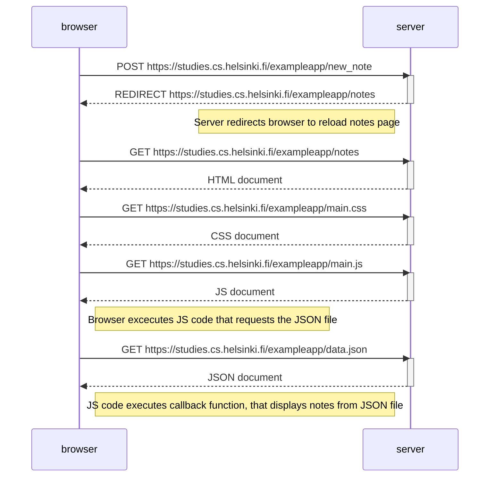

```mermaid
sequenceDiagram
    participant browser
    participant server

    browser->>server: POST https://studies.cs.helsinki.fi/exampleapp/new_note
	activate server
	server-->>browser: REDIRECT https://studies.cs.helsinki.fi/exampleapp/notes
	deactivate server

    Note left of server: Server redirects browser to reload notes page

    browser->>server: GET https://studies.cs.helsinki.fi/exampleapp/notes
	activate server
	server-->>browser: HTML document
	deactivate server

	browser->>server: GET https://studies.cs.helsinki.fi/exampleapp/main.css
	activate server
	server-->>browser: CSS document
	deactivate server

	browser->>server: GET https://studies.cs.helsinki.fi/exampleapp/main.js
	activate server
	server-->>browser: JS document
	deactivate server

	Note right of browser: Browser excecutes JS code that requests the JSON  file
	
	browser->>server: GET https://studies.cs.helsinki.fi/exampleapp/data.json
	activate server
	server-->>browser: JSON document
	deactivate server

	Note right of browser: JS code executes callback function, that displays notes from JSON file
```

