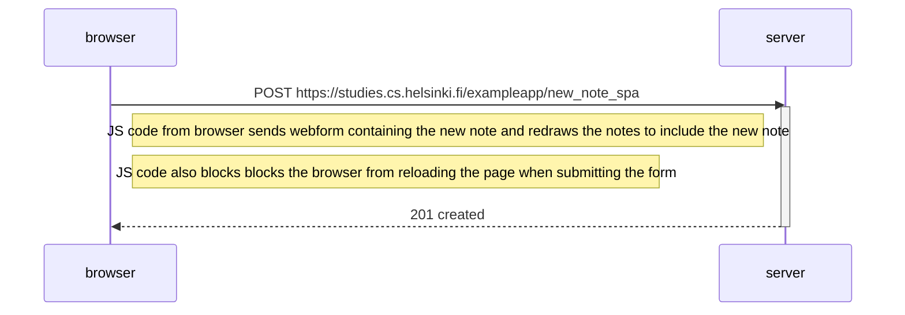

```mermaid
    sequenceDiagram
        participant browser
        participant server

        browser->>server: POST https://studies.cs.helsinki.fi/exampleapp/new_note_spa
        activate server

        Note right of browser: JS code from browser sends webform containing the new note and redraws the notes to include the new note
        Note right of browser: JS code also blocks blocks the browser from reloading the page when submitting the form
        server-->>browser: 201 created
        deactivate server
```
